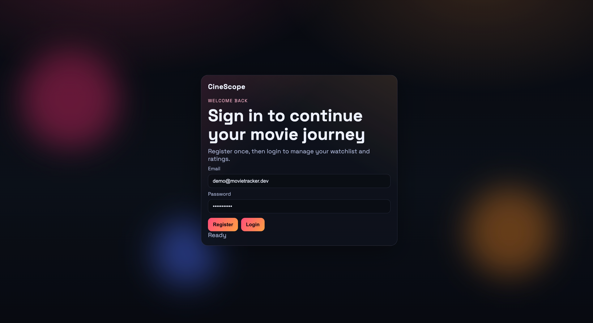
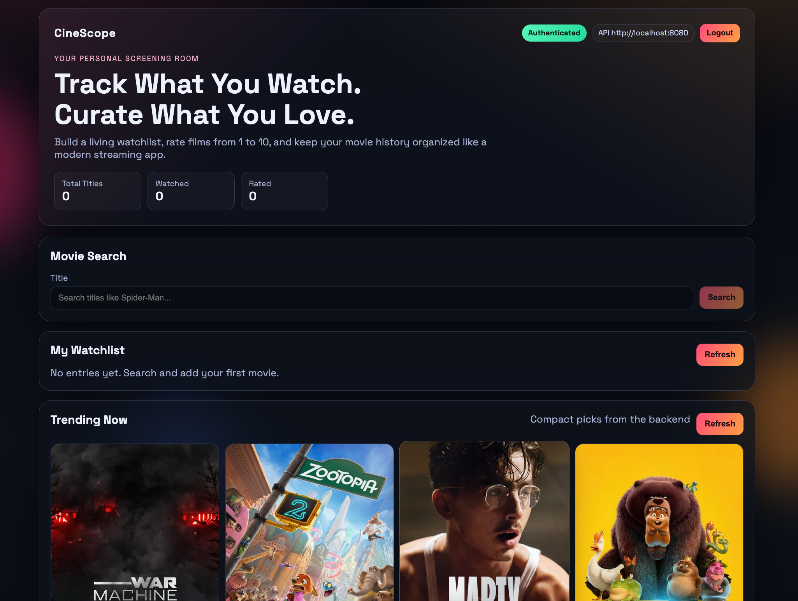
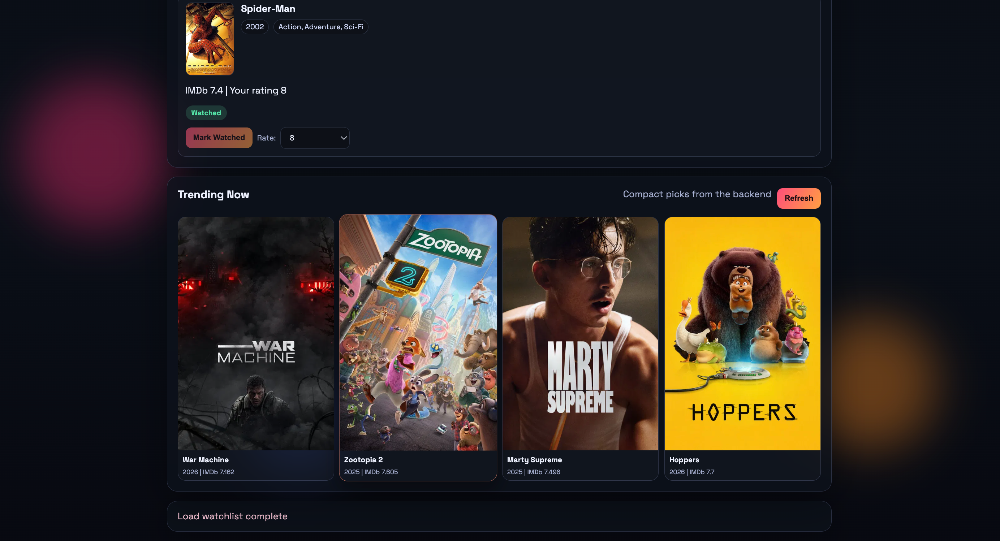

# MovieTracker (Spring Boot + React)

MovieTracker is a full-stack project where users can register/login, search movies using OMDb, and manage a personal watchlist.

## UI Preview
### Screenshot 1 - Login / Register


### Screenshot 2 - Watchlist


### Screenshot 3 - Trending


## Architecture
- Backend: Spring Boot, Spring Security (JWT), JPA, PostgreSQL
- Cache: Redis (Spring Cache abstraction)
- Frontend: React + Vite
- Infra: Docker + docker-compose

## Core Features
- JWT-based register/login flow
- Movie search with autocomplete suggestions
- Add to watchlist, mark watched, and rate movies (1-10)
- Trending movie cards with poster images
- Redis-backed caching for search/suggestions performance
- Structured global exception handling and health endpoint (`/actuator/health`)

## Key Backend Decisions
- Stateless auth using JWT
- Ownership-based watchlist access (user sees only their own entries)
- Global exception handling with structured JSON errors
- Environment-based configuration for secrets and runtime behavior
- Actuator health endpoint for production readiness
- Redis-backed cache for movie search to reduce repeated OMDb calls

## Full Stack Run (Docker)
```bash
cp .env.example .env
# fill JWT_SECRET and OMDB_API_KEY

docker compose up --build
```

URLs:
- Frontend: `http://localhost:4173`
- Backend API: `http://localhost:8080`

Backend health:
- `GET http://localhost:8080/actuator/health`

Run tests:
```bash
./mvnw test
```

## Demo Note
- Public live deployment is intentionally not exposed to avoid third-party API quota abuse and key leakage.
- This repo is fully reproducible locally using Docker with environment variables.
- Screenshots above show the working UI/flows.

## Frontend Run
```bash
cd frontend
cp .env.example .env
npm install
npm run dev
```

Frontend:
- `http://localhost:5173`

## Interview Summary
- "I built a secure stateless REST API with JWT and PostgreSQL."
- "I integrated OMDb as an external dependency and persisted unique movies by imdbID to avoid duplicates."
- "I containerized app + database using Docker Compose for local and cloud parity."
- "I externalized secrets (JWT, OMDb key, DB credentials) and added actuator health checks for deployment readiness."
- "I shipped a modern React UI with login-first flow, autocomplete search, poster-rich watchlist, and trending suggestions."
